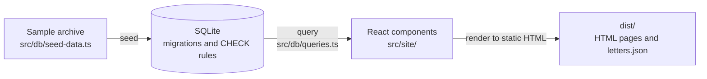

# Letters Archive

A small archive of fictional historical letters. A SQLite database is the
source of truth, and a build script turns it into a static, accessible
website that needs no JavaScript.

It explores how a static site generated from a relational database can
present uncertain historical evidence, in the style of digital humanities
research software.

**Live site:** https://lylafibert.github.io/letters-archive/

## Highlights

- **Uncertain dates done properly.** Each date keeps the source's own words
  and where they came from, plus a range that can be searched and sorted,
  using the [EDTF](https://www.loc.gov/standards/datetime/) standard.
- **The database rejects bad data itself**, with `STRICT` tables, `CHECK`
  rules and foreign keys.
- **Static HTML from React**, rendered at build time, so no JavaScript is
  sent to the browser.
- **Accessible**, with every built page validated as part of the tests.

## Getting started

Requires Node 24 (`nvm use`).

```sh
npm install
npm run check      # lint, typecheck, formatting and tests
npm run build      # rebuilds the database, then writes the site to dist/
npx serve dist     # preview locally (pages are directories, so use a server)
```

`npm run db:reset` rebuilds `data/archive.sqlite` on its own, and
`npm run format` applies Prettier. Scripts run TypeScript directly through
`tsx`, so there is no compile step.

## How it works



| Folder | Responsibility |
|---|---|
| `src/db/` | Migrations, seeding and queries |
| `src/dates/` | EDTF → range, calendar arithmetic, describing ranges in words, decades |
| `src/model/` | Domain types |
| `src/site/` | Paths, page data, React components and pages, the build |
| `tests/integration/` | Schema rules, seeding, queries and the whole built site |

Unit tests sit next to the code they test.

## Design decisions

The full reasoning is in [`docs/design.md`](docs/design.md), and the date
rules are in [`docs/dates.md`](docs/dates.md). In short:

- **Dates are stored three ways.** The words of the source (and which source:
  dateline, postmark, archivist's note and so on), the cataloguer's reading
  in EDTF, and an earliest and latest date derived from it. "Spring 1843" is
  `1843-21`, from `1843-03-01` to `1843-05-31`. Keeping the source's words
  matters because a writer's "spring 1843" and an archivist's "1840s" are
  different kinds of evidence.
- **EDTF is parsed by an existing library**,
  [`@edtf-ts/core`](https://github.com/BobPritchett/edtf-ts), chosen over the
  better-known `edtf` package because that one treats spring as
  January–March and has no TypeScript types.
- **Letters are keyed by catalogue reference** (`MAR/001`), which is stable
  and what archivists cite. Correspondents and places get integer ids,
  because names aren't stable or unique.
- **A letter appears in every decade its date range overlaps**, marked as
  possible unless it falls wholly inside, so browsing by decade never misses
  a letter.

## Known limitations / possible improvements

- **One sender per letter.** The schema stores a single `sender_id` on each
  letter, so jointly written letters can't be represented. The fix would be a
  link table (`letter_id`, `correspondent_id`) allowing any number of senders
  (and likewise recipients). To keep the scope small, the sample letters
  have one sender each.
- **One name per correspondent.** People who changed their name, such as on
  marriage (Hannah Greaves, later Penhallow), are stored under a single name.
- **No live filtering.** A small script to filter the letter list in the
  browser, as progressive enhancement, was left out to keep the scope small.
- **Plain-text transcriptions.** Editorial markup (italic ship names,
  underlining) isn't represented. TEI would be the standard for this.
- **Fail loudly in a few more places.** Some rules are enforced by the
  schema but not re-checked in code. For example, `parseIsoDate` accepts
  impossible dates such as `1843-13-45`. These should throw clear errors.
- **Correspondent URLs come from names.** Two correspondents with the same
  name would collide. The build fails loudly rather than overwrite a page.

## Use of AI

Claude is used as a pair programmer for implementation. Design, standards
and review are led by the maintainer. Key decisions included:

- **Modelled the domain before the database.** Sketched the data model as
  TypeScript types first, and settled what a missing value means. `NULL`
  marks something that existed but isn't known, such as a letter's recipient
  or where it was sent from, and empty strings are rejected.
- **Weighed the cost of a better model.** Assessed what supporting
  organisations as well as people would change, then generalised senders and
  recipients into correspondents.
- **Chose a standard over custom code.** Replaced a planned hand-written date
  parser with EDTF, the established standard for uncertain dates, and an
  existing library.
- **Defined the standards before the audit.** Had an agent build a profile of
  the maintainer's coding standards from hundreds of past commits, code
  reviews and AI sessions, then audited this codebase against it. Best
  practice wins wherever the two conflict, and each conflict was raised as a
  question.
- **Kept scope deliberate.** Took on improvements only where they clearly
  paid off. Turned down tooling that was overkill for the project's size,
  such as Dependabot, and recorded the trade-offs left open under known
  limitations.
- **Checked claims, not just code.** Questioned whether the integration tests
  were really integration tests, and had accessibility and colour contrast
  measured rather than assumed.

Generated code is only trusted as far as it is tested. CI runs linting, type
checks and the full test suite on every push. The integration tests build
the real site and validate every page.

## Licence

[MIT](LICENSE)
